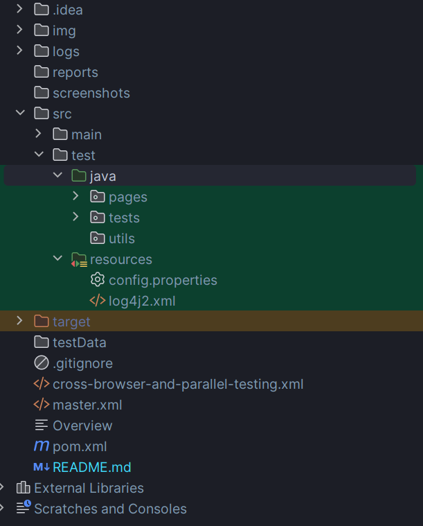

# Open Cart E-Commerce Project

### Objectives

- Build Hybrid Automation Framework from scratch
- Get hands-on experience with end-to-end tools for Selenium Java Automation

### Purpose

- Work on a project that mimics real world project workflows

### Technologies/Tools Used:

- Programming Language: `Java`
- Build Tool: `Maven`
- Test Framework: `TestNG`
- Test Execution: `Selenium WebDriver & Selenium Grid`
- Configuration Management: `xml and .properties file`
- Logging: `Log4j2`
- Reporting: `Extent Reports`
- Data-Driven Testing: `Excel-based test data`
- CI: `Jenkins`
- Containerization and Parallel Execution: `Docker with Selenium Grid`
- Test Execution Methods: `Maven, Command Prompt, and run.bat file`

### Steps
1. Add necessary dependencies to pom.xml
2. Create appropriate framework folder structure
   - 
3. Automate Account Registration test case
   - Create `BasePage`(Reduce code duplication/Reusability)
   - Create `HomePage` and `AccountRegistrationPage`
   - Create `AccountRegistrationTest`
4. Add logging
5. Parameterize browser
6. Execute tests across multiple browsers
7. Enable Parallel Execution of tests
8. Read values from `.properties` file
9. Automate Login test case
    - Create/Update Page Classes:
        - `LoginPage` (New)
        - `MyAccountPage` (New)
        - `HomePage` (Updated)
    - Create `LoginTest`
    - Add `LoginTest` to XML file
10. Automate Data-Driven Login test case